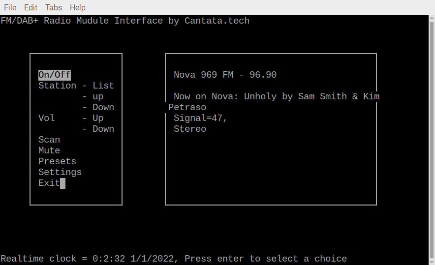

# Cantata curses interface for Sixth-Logic/Monkeyboard DABFM boards

A Simple Character-based Curses Client for Sixth-Logic/Monkeyboard DAB/FM Boards that will work on Linux including the Raspberry-Pi.

This is a no frills Character based Client written in C++ for Keystone DAB boards made by Sixth-Logic/Monkeyboard.

## Screenshot

## Operation

Keys

|  Key          |  Function            |
|---------------|----------------------|
|  n            |  Next Station        |
|  p            |  Previous Station    |
|  b            |  Mode DAB<-->FM      |
|  +            |  Volume Up           |
|  -            |  Volume Down         |
|  m            |  Mute                |

## Installation

You will need to ensure that Curses libraries are installed.

Install the Keystone libraries from Six-Logic/Monkeyboard

## Building

make

## Running

./cantataCDAB

